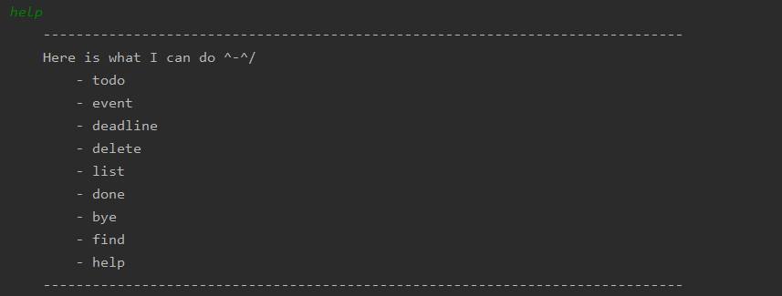
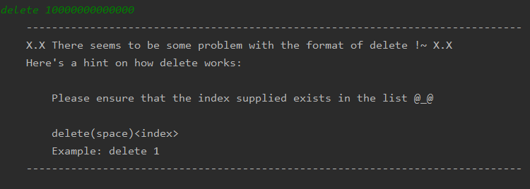

# User Guide
# Table of content
<!-- TOC -->
- [Introduction](#introduction)
- [Features](#features)
- [Usage](#usage)
    - [View help: `help`](#help---prints-the-entire-list-of-command)
    - [Exit duke: `bye`](#bye---exits-the-application)
    - [Add todo task: `todo`](#todo---adds-a-todo-command-to-the-list)
    - [Add event task: `event`](#event---adds-a-event-task-to-the-list)
    - [Add deadline task: `deadline`](#deadline---adds-a-deadline-task-to-the-list)
    - [View list: `list`](#list---prints-the-entire-list-of-tasks-added)
    - [Mark as done: `done`](#done---marks-a-task-in-the-list-as-done)
    - [Find specific task: `find`](#find---finds-all-tasks-that-contains-keyword)
    - [Delete specific task: `delete`](#delete---delete-a-task-from-the-list)
    
<!-- TOC -->

## Introduction
Duke is a personal task manager that assist the user to keep track of their schedule. Running on a command line interface,
duke is designed for users who type fast and prefers a CLI interface as opposed to a GUI. 
## Features 

#### View help
Duke allows you to view its available commands within the application.  

#### Keeps track of your tasks
With Duke, you can keep track of various tasks such as Todo, Event and Deadline tasks.

#### View all your tasks
Want to see what tasks you have done (or not yet done)? Duke can show you all your tasks you are currently tracking. 
 
#### Mark your task as done
Done with a task? Duke allows you to mark a specific task as done. 
 
#### Finding a specific task
Can't remember what task you've added? Duke allows you to filter tasks by searching for a keyword. 

#### Auto-saves 
Duke auto saves after any modifications to your tasks. So you do not have to worry about random 
[crashes](https://en.wikipedia.org/wiki/Crash_(computing)) anymore!

## Usage

### `help` - Prints the entire list of command.

List all commands that can be executed on the application

Example of usage: 

`help`

Expected outcome:

 

### `bye` - Exits the application.

Exits the application upon input of this command

Example of usage: 

`bye`

Expected outcome:

### `todo` - Adds a `todo` command to the list.

Adds a `todo` task to the list. Upon successful addition of task,
a confirmation message will be printed. 

An error message will be printed if the supplied format is wrong.

Example of usage: 

* Correct format example: `todo homework`
* Incorrect format example: `todo `

Expected outcome:
* If successful

    
 
* If unsuccessful

    

### `event` - Adds a `event` task to the list. 

Adds a `event` task to the list. Upon successful addition of task,
a confirmation message will be printed. 

An error message will be printed if the supplied format is wrong

Example of usage: 

* Correct format example: `event team meeting /at NUS 3-4pm`
* Incorrect format example : `event team meeting at NUS 3-4pm`

Expected outcome:
* If successful

    

* If unsuccessful

    

### `deadline` - Adds a `deadline` task to the list.

Adds a `deadline` task to the list. Upon successful addition of task,
a confirmation message will be printed. 

An error message will be printed if the supplied format is wrong

Example of usage: 

* Correct format example : `deadline submit iP /by March 2`

* Incorrect format example : `deadline submit iP by March 2`

Expected outcome:
* If successful

    
* If unsuccessful

    
    
### `list` - Prints the entire list of tasks added.

Prints the entire list of tasks that was added by User.

Example of usage:

`list'

Expected outcome:

### `done` - Marks a task in the list as done.

Marks a task at the specified index in the list as done.

Upon successful mark, a confirmation message will be printed.

An error message will be printed if the task does not exist

Example of usage:

* Correct format example: `done 1`
* Incorrect format example: `done 100000000000`

Expected outcome:
* If successful

    
* If unsuccessful

    
    
### `find` - Finds all tasks that contains keyword

Finds all tasks that matches supplied keyword exactly
or contains a substring of keyword.

If there are any tasks which matches the keyword, 
a list will be printed out.

If there are no task that matches a keyword, 
no matching tasks will be printed.

Example of usage:

* Matching usage example: `find homework`

* No matches usage example: `find homewk`

Expected outcome:

* If matches keyword
    
    
    
* If no matches

    
    
### `delete` - Delete a task from the list

Deletes a task at the specified index of the list

Upon successful mark, a confirmation message will be printed.

An error message will be printed if the task does not exist

Example of usage:

* Correct format example: `delete 1`
* Incorrect format example: `delete 100000000000`

Expected outcome:
* If successful: 
* If unsuccessful 
    
